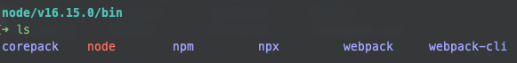

# webpack系统学习

## 模块化开发

### 原生模块化开发

`./src/js/math.js` 定义一个功能模块

```javascript
export const sum = (num1, num2) => {
  return num1 + num2
}

export const mul = (num1, num2) => {
  return num1 * num2
}

```


`./src/index.js` 引入功能模块

```javascript
import { sum, mul } from './js/math.js'
// 需要补全后缀，平时项目不用写后缀是因为配置了自动补全

console.log(sum(2,3))
console.log(mul(3,  4))

```

> 引入文件需要填写完整的后缀


`./index.html` 使用模块化

```html
<!DOCTYPE html>
<html lang="en">
<head>
  <meta charset="UTF-8">
  <title>Title</title>
</head>
<body>

<!--这里的需要以 module 的类型引入,且仅限在支持ES6模块化的浏览器中-->
<script src="src/index.js" type="module"></script>
</body>
</html>

```

> 需要以 module 的形式引入，且需要在支持ES6模块化的浏览器


这时候用浏览器打开 `index.html` 在控制台中可以看到输出结果

```
5
12
```

 

## 项目初始化

1. 项目初始化：`npm init -y`

2. 安装依赖 ：`npm install webpack webpack-cli -D`

3. 使用局部webpack命令的几种方式

   - script 的方式

     - 在package.json 文件中，scripts 里添加 `"build": "webpack"`
     - 执行 `npm run build`

   - npx 方式

     - `npx webpack`

   - 直接使用node_modules里面的 webpack 命令

     - `./node_modules/.bin/webpack`

     > 以上两种方式的本质都是调用 `./node_modules/.bin/webpack` 里面的命令


> 局部webpack命令与全局webpack命令的区别
>
> 1. 全局webpack
>    - 使用 `npm install -g webpack webpack-cli`
>    - 安装的位置：我的node使用的是nvm进行多版本管理，目录为用户根目录下 `~/.nvm/versions/node/v16.15.0/bin`
>      
>    - 在所有的目录下都可以直接执行 `webpack` 命令
> 2. 局部 webpack
>    - 在项目中使用 `npm install -D webpack webpack-cli`
>    - 安装位置：项目根目录下的 `node_modules` 文件夹中
>    - 只能在项目目录下，通过以上的局部命令的方式调用


## 样式打包

参考官方文档

- 打包css：[css-loader](https://webpack.docschina.org/loaders/css-loader/)
- 打包less：[less-loader](https://webpack.docschina.org/loaders/less-loader/)
- 打包sass：[sass-loader](https://webpack.docschina.org/loaders/sass-loader/)
- 样式都需要配置低版本浏览器兼容：[postcss-loader](https://webpack.docschina.org/loaders/postcss-loader/)


## 其他资源打包

新版的webpack5已经不使用以下的打包方式

- [`raw-loader`](https://v4.webpack.js.org/loaders/raw-loader/) 将文件导入为字符串
- [`url-loader`](https://v4.webpack.js.org/loaders/url-loader/) 将文件作为 data URI 内联到 bundle 中
- [`file-loader`](https://v4.webpack.js.org/loaders/file-loader/) 将文件发送到输出目录


而是使用`资源模块类型(asset module type)`，通过添加 4 种新的模块类型，来替换以上所有这些 loader：

- `asset/resource` 发送一个单独的文件并导出 URL。之前通过使用 `file-loader` 实现。
- `asset/inline` 导出一个资源的 data URI。之前通过使用 `url-loader` 实现。
- `asset/source` 导出资源的源代码。之前通过使用 `raw-loader` 实现。
- `asset` 在导出一个 data URI 和发送一个单独的文件之间自动选择。之前通过使用 `url-loader`，并且配置资源体积限制实现。


更多使用细节可以参考官方文档的 [资源模块](https://webpack.docschina.org/guides/asset-modules/)

源码在 [source-pack 分支](https://github.com/Micah-Yu/webpack-stu/tree/source-pack)
